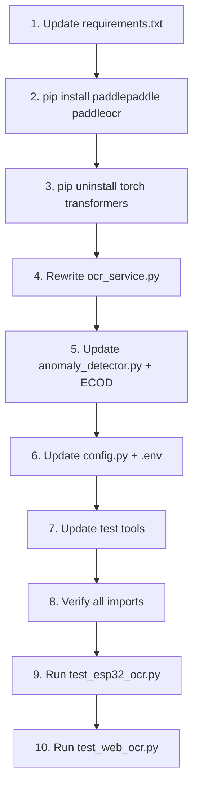

# Nâng cấp Pipeline: YOLOv11n + PaddleOCR v4 + PyOD (IForest/ECOD)

## Mục tiêu

Thay thế pipeline hiện tại (YOLOv8n + TrOCR + PyOD IForest) bằng pipeline mới theo sơ đồ:

```
[ESP32-CAM]
    │ ảnh JPEG
    ▼
[Server / Edge PC]
    ├── YOLOv11n  →  detect vùng số  →  crop ROI
    ├── PaddleOCR v4  →  đọc chữ số  →  "012345"
    ├── PyOD (Isolation Forest / ECOD)  →  anomaly score
    └── MQTT / HTTP  →  Dashboard / Database
```

## Tại sao thay đổi?

| Thành phần | Hiện tại | Nâng cấp | Lý do |
|---|---|---|---|
| Object Detection | YOLOv8n (`6.2MB`) | **YOLOv11n** (`5.4MB`) | Nhẹ hơn 12%, mAP cao hơn ~2%, tốc độ ngang nhau |
| OCR | TrOCR (`~350MB` + torch) | **PaddleOCR v4** (`~15MB`) | Nhẹ hơn **23x**, CPU-native, không cần torch, accuracy ~93%+ |
| Anomaly | IForest only | **IForest + ECOD** | ECOD parameter-free, interpretable, dùng làm ensemble |

> [!IMPORTANT]
> **Thay TrOCR → PaddleOCR sẽ loại bỏ hoàn toàn dependency `torch` (~2GB)** và `transformers` (~500MB). Đây là lợi ích lớn nhất — giảm ~2.5GB disk, startup nhanh hơn 10x.

## User Review Required

> [!WARNING]
> **Breaking change:** Loại bỏ hoàn toàn `torch` và `transformers` khỏi requirements. Nếu project có chỗ khác đang dùng torch, cần xác nhận trước.

> [!IMPORTANT]
> **PaddleOCR cần `paddlepaddle`** (~150MB CPU version) thay thế torch. Nhẹ hơn rất nhiều nhưng vẫn cần install.

---

## Proposed Changes

### Component 1: Dependencies

#### [MODIFY] [requirements.txt](file:///d:/Antigravity/Smart-Electricity-Meter/backend/requirements.txt)

**Xóa:**
```diff
- # OCR — Stage 2: TrOCR digit recognition (Microsoft Transformer)
- transformers>=4.40.0
- torch>=2.2.0
```

**Thay bằng:**
```diff
+ # OCR — PaddleOCR v4 (digit recognition, CPU-native)
+ paddlepaddle>=3.0.0
+ paddleocr>=2.9.0
```

**Giữ nguyên:** `ultralytics>=8.3.0` (hỗ trợ cả YOLOv8 và v11)

---

### Component 2: OCR Service

#### [MODIFY] [ocr_service.py](file:///d:/Antigravity/Smart-Electricity-Meter/backend/app/ocr_service.py)

**Thay đổi chính:**

1. **Xóa toàn bộ** `_get_trocr()` và `_recognize_digits()` (TrOCR code)
2. **Thêm** `_get_paddle_ocr()` — lazy-load PaddleOCR singleton
3. **Đổi** `_get_yolo()` — model path `yolov8n.pt` → `yolo11n.pt`
4. **Thay** Stage 2 logic:

```python
# Singleton PaddleOCR
_paddle_ocr = None

def _get_paddle_ocr():
    global _paddle_ocr
    if _paddle_ocr is None:
        from paddleocr import PaddleOCR
        _paddle_ocr = PaddleOCR(
            use_angle_cls=False,  # meter digits không cần xoay
            lang="en",
            show_log=False,
            use_gpu=False,
        )
    return _paddle_ocr

def _recognize_digits_paddle(image: Image.Image) -> tuple[str, float]:
    """Run PaddleOCR trên crop ảnh, trả về (text, confidence)."""
    ocr = _get_paddle_ocr()
    img_array = np.array(image.convert("RGB"))
    results = ocr.ocr(img_array, cls=False)
    
    if not results or not results[0]:
        return "", 0.0
    
    texts, confs = [], []
    for line in results[0]:
        text = line[1][0]
        conf = line[1][1]
        texts.append(text)
        confs.append(conf)
    
    return "".join(texts), sum(confs) / len(confs) if confs else 0.0
```

5. **Pipeline flow giữ nguyên:**
```
Image → preprocess → YOLO11n detect ROI → PaddleOCR recognize → parse value
                         ↓ (fallback)
                  PaddleOCR on full image
```

6. **Public API không đổi:** `extract_digits()`, `decode_base64_image()` giữ nguyên signature → `mqtt_handler.py` không cần sửa.

---

### Component 3: Anomaly Detector

#### [MODIFY] [anomaly_detector.py](file:///d:/Antigravity/Smart-Electricity-Meter/backend/app/anomaly_detector.py)

**Thay đổi chính:**

1. **Thêm ECOD** như algorithm thứ 2 bên cạnh IForest:

```python
async def train_model(self, device_id: str) -> dict:
    from pyod.models.iforest import IForest
    from pyod.models.ecod import ECOD
    
    # Train cả 2 models
    iforest = IForest(n_estimators=100, contamination=0.05)
    ecod = ECOD(contamination=0.05)
    
    iforest.fit(features)
    ecod.fit(features)
    
    # Lưu cả 2
    pickle.dump({"iforest": iforest, "ecod": ecod}, f)
```

2. **Ensemble scoring** — kết hợp score từ cả 2 models:

```python
async def _check_ml_anomaly(self, device_id, current_kwh):
    models = self._load_model(device_id)  # {"iforest": ..., "ecod": ...}
    
    iforest_pred = models["iforest"].predict(features)
    ecod_pred = models["ecod"].predict(features)
    
    # Ensemble: anomaly nếu CẢ 2 đồng ý (giảm false positive)
    is_anomaly = (iforest_pred[0] == 1) and (ecod_pred[0] == 1)
    
    # Hoặc: dùng average score
    avg_score = (iforest_score + ecod_score) / 2
```

3. **ECOD feature-wise explanation** — thêm giải thích cụ thể feature nào bất thường:

```python
# ECOD cho biết feature nào đóng góp nhiều nhất vào anomaly
feature_names = ["kwh", "hour", "weekday", "avg_7d", "delta"]
ecod_contributions = ecod.explain(feature_array)
top_feature = feature_names[np.argmax(ecod_contributions)]
# → "AI phát hiện bất thường chủ yếu do: delta so với trung bình 7 ngày"
```

---

### Component 4: Configuration

#### [MODIFY] [config.py](file:///d:/Antigravity/Smart-Electricity-Meter/backend/app/config.py)

```python
# OCR — YOLOv11n + PaddleOCR v4 Pipeline
YOLO_MODEL_PATH: str = "yolo11n.pt"     # đổi từ yolov8n.pt
OCR_CONFIDENCE_THRESHOLD: float = 0.6
YOLO_CONFIDENCE_THRESHOLD: float = 0.3
# Xóa: TROCR_MODEL_NAME (không còn dùng)

# Anomaly Detection — thêm ECOD
ANOMALY_ML_ALGORITHM: str = "ensemble"   # "iforest" | "ecod" | "ensemble"
ANOMALY_IFOREST_CONTAMINATION: float = 0.05
ANOMALY_ECOD_CONTAMINATION: float = 0.05
```

#### [MODIFY] [.env](file:///d:/Antigravity/Smart-Electricity-Meter/backend/.env) + [.env.example](file:///d:/Antigravity/Smart-Electricity-Meter/backend/.env.example)

```env
# ── OCR Settings (YOLOv11n + PaddleOCR v4) ──
YOLO_MODEL_PATH=yolo11n.pt
OCR_CONFIDENCE_THRESHOLD=0.6
YOLO_CONFIDENCE_THRESHOLD=0.3

# ── Anomaly Detection ──
ANOMALY_ML_ALGORITHM=ensemble
ANOMALY_IFOREST_CONTAMINATION=0.05
ANOMALY_ECOD_CONTAMINATION=0.05
```

---

### Component 5: Test Tools

#### [MODIFY] [test_esp32_ocr.py](file:///d:/Antigravity/Smart-Electricity-Meter/backend/test_esp32_ocr.py)
- Đổi log message: "YOLO+TrOCR" → "YOLOv11n+PaddleOCR"

#### [MODIFY] [test_web_ocr.py](file:///d:/Antigravity/Smart-Electricity-Meter/backend/test_web_ocr.py)
- Đổi header/subtitle text
- Pipeline badge: hiển thị "yolo11n+paddleocr" thay vì "yolo+trocr"

---

### Component 6: ML Router (không đổi)

#### [KEEP] [routers/ml.py](file:///d:/Antigravity/Smart-Electricity-Meter/backend/app/routers/ml.py)
- API `/api/ml/train/{device_id}`, `/api/ml/train-all`, `/api/ml/status/{device_id}` giữ nguyên
- Internal logic tự động train cả IForest + ECOD thông qua `anomaly_detector.py`

---

## Dependency Diff

| Package | Trước | Sau | Kích thước |
|---|---|---|---|
| `torch` | ✅ | ❌ Xóa | **-2GB** |
| `transformers` | ✅ | ❌ Xóa | **-500MB** |
| `paddlepaddle` | ❌ | ✅ Thêm | +150MB |
| `paddleocr` | ❌ | ✅ Thêm | +15MB |
| `ultralytics` | ✅ | ✅ Giữ | ~50MB |
| `pyod` | ✅ | ✅ Giữ | ~5MB |

**Tổng:** Giảm ~**2.3GB** disk, startup nhanh hơn đáng kể.

---

## Verification Plan

### Automated Tests
```bash
# 1. Install mới
pip install paddlepaddle paddleocr --quiet
pip uninstall torch transformers -y

# 2. Verify imports
python -c "from ultralytics import YOLO; YOLO('yolo11n.pt'); print('YOLOv11 OK')"
python -c "from paddleocr import PaddleOCR; PaddleOCR(lang='en', show_log=False); print('PaddleOCR OK')"
python -c "from pyod.models.ecod import ECOD; print('ECOD OK')"

# 3. Test OCR pipeline
python test_esp32_ocr.py --generate
python test_esp32_ocr.py --image test_output/sample_meter.jpg

# 4. Test Web UI
python test_web_ocr.py  # → http://localhost:8501

# 5. Test FastAPI app start
python -c "from app.main import app; print('App OK')"
```

### Manual Verification
- Upload ảnh công tơ thật qua Web UI test
- So sánh accuracy giữa pipeline cũ (TrOCR) và mới (PaddleOCR)
- Kiểm tra anomaly detection có ECOD explanation trong alert

---

## Execution Order



Estimated time: **~15 phút** implementation + **~5 phút** testing.
